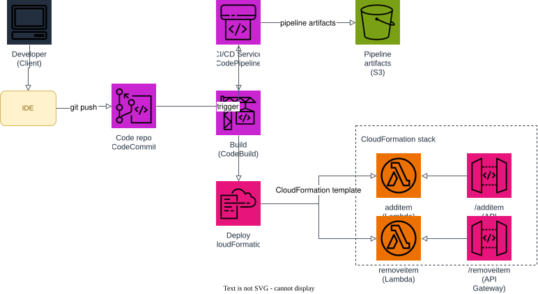

# AWS Project: CI/CD for Serverless Applications

A continuous integration and delivery (CI/CD) pipeline for serverless applications, built with Floci and Terraform, so features and fixes ship quickly and reliably:

1. a developer pushes code to a CodeCommit repository;
2. CodePipeline picks up the change and starts the pipeline;
3. CodeBuild packages the Lambda source and the CloudFormation template (`aws cloudformation package`), uploading the build artifact to an S3 bucket;
4. the Deploy stage applies the packaged template via CloudFormation, creating or updating a stack that contains the `additem` and `removeitem` Lambda functions and their API Gateway routes.

## Prerequisites

- Docker
- Terraform 1.5+
- AWS CLI

## Start Floci

```bash
docker compose up -d
```

## Apply Terraform

```bash
terraform init
terraform apply
```

This provisions the CodeCommit repository, the S3 artifact bucket, the CodeBuild project, the CodePipeline pipeline, and the IAM roles the pipeline uses. It does **not** create the application resources (Lambda + API Gateway) directly — those are deployed by the pipeline itself via the CloudFormation Deploy stage, exactly like a real CI/CD pipeline for serverless workloads.

## Architecture



A developer pushes from their IDE to the CodeCommit repo, which triggers CodePipeline. The Build stage (CodeBuild) packages the Lambda source and the CloudFormation template, storing the artifact in an S3 bucket. The Deploy stage applies the packaged template via CloudFormation, creating/updating a stack with the `additem` and `removeitem` Lambda functions behind their own API Gateway routes.

The diagram source is a real, editable [draw.io](https://www.drawio.com/) file at [docs/architecture.drawio](docs/architecture.drawio), generated programmatically with the [drawpyo](https://github.com/MerrimanInd/drawpyo) Python library. Open the `.drawio` file directly on GitHub or with the draw.io desktop app / [app.diagrams.net](https://app.diagrams.net/) to edit it.

To regenerate the diagram (`.drawio` source + the `.svg`/`.png` embedded above) after changing the architecture:

```bash
python3 -m venv .diagram-venv
.diagram-venv/bin/pip install drawpyo
.diagram-venv/bin/python scripts/generate_diagram.py

# rasterize the .drawio file to svg/png (used by the README) via headless draw.io
docker run --rm -v "$PWD/docs":/data -w /data rlespinasse/drawio-export -f svg -o . --output-mode relative --remove-page-suffix .
docker run --rm -v "$PWD/docs":/data -w /data rlespinasse/drawio-export -f png -o . --output-mode relative --remove-page-suffix -t .
```

## Trigger the pipeline

Push the application source (Lambda handlers, `templates/app-stack.yaml`, `buildspec.yml`) to the CodeCommit repository to kick off a pipeline run:

```bash
REPO_URL=$(terraform output -raw codecommit_clone_url_http)

git clone "$REPO_URL" pipeline-source
cp -r src templates buildspec.yml pipeline-source/
cd pipeline-source
git add -A
git commit -m "Deploy item API"
git push origin main
```

Watch the pipeline progress and the deployed stack:

```bash
aws --endpoint-url http://localhost:4566 codepipeline get-pipeline-state \
  --name "$(terraform output -raw pipeline_name)"

aws --endpoint-url http://localhost:4566 cloudformation describe-stacks \
  --stack-name "$(terraform output -raw cloudformation_stack_name)"
```

## Test the deployed API

Once the Deploy stage finishes, call the `additem` and `removeitem` routes:

```bash
API_URL=$(aws --endpoint-url http://localhost:4566 cloudformation describe-stacks \
  --stack-name "$(terraform output -raw cloudformation_stack_name)" \
  --query "Stacks[0].Outputs[?OutputKey=='ApiEndpoint'].OutputValue" --output text)

# add an item
ITEM_ID=$(curl -s -X POST "$API_URL/additem" -d '{"name": "example"}' | jq -r '.id')

# remove it
curl -s -X POST "$API_URL/removeitem" -d "{\"id\": \"$ITEM_ID\"}"
```

If you want to follow the execution, watch the Floci container logs:

```bash
docker compose logs -f floci
```

## Clean up

```bash
terraform destroy
docker compose down
```
